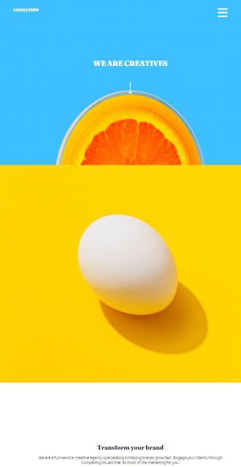
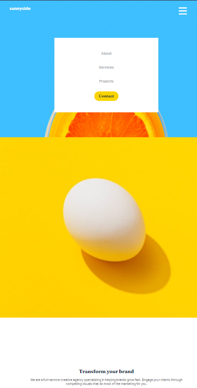
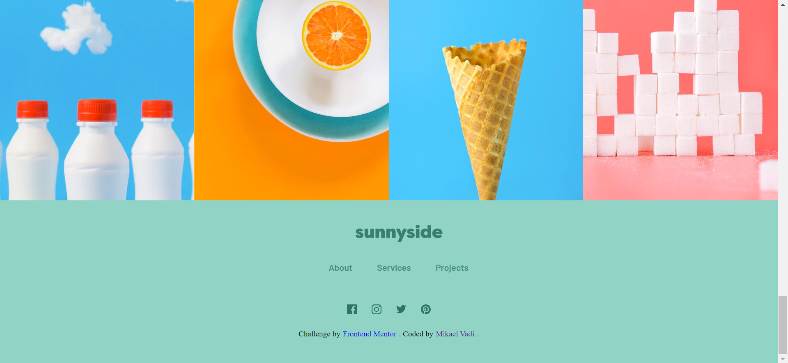

# Frontend Mentor - Sunnyside agency landing page solution

This is a solution to the [Sunnyside agency landing page challenge on Frontend Mentor](https://www.frontendmentor.io/challenges/sunnyside-agency-landing-page-7yVs3B6ef). Frontend Mentor challenges help you improve your coding skills by building realistic projects.

## Table of contents

- [Overview](#overview)
  - [The challenge](#the-challenge)
  - [Screenshot](#screenshot)
  - [Links](#links)
- [My process](#my-process)
  - [Built with](#built-with)
  - [What I learned](#what-i-learned)
  - [Continued development](#continued-development)
- [Author](#author)

## Overview

### The challenge

Users should be able to:

- View the optimal layout for the site depending on their device's screen size
- See hover states for all interactive elements on the page

### Screenshots

### Links

- Solution URL: [GitHub Repo](https://github.com/mikael-v/Agency-Landing-Page)
- Live Site URL: [https://agency-landing-page-mikael.vercel.app/](https://agency-landing-page-mikael.vercel.app/)

## My process

### Built with

- Semantic HTML5 markup
- CSS custom properties
- Flexbox
- Mobile-first workflow

### What I learned

During this project I learned more about responsive design for different devices and while I am still not 100% confident with this, the time put in has helped build that confidence and improve the way I approach responsive styling.

I also learned how to make the interface appear different based on the device, by having mobile devices replace the navigation bar with a hamburger menu.

### Continued development

I would like to come back to this project at a later date and change some of the responsive stylign features so they are more flexible, for example on desktop zooming in/out of the page it effects some of the styling at the moment.

After improving this page, I'd like to have a go at using CSS grid, since I tend to rely more on flexbox. As well as perhaps using other technologies such as React or Vue.

## Author

- Website - [Mikael Vadi](https://mikael-vadi.netlify.app/)
- Frontend Mentor - [@mikael-v](https://www.frontendmentor.io/profile/mikael-v)
- Linkedin - [Linkedin Profile](https://www.linkedin.com/in/mikael-vadi-516b59313/)

